Here’s a detailed synthesis of the four attached chapters, focusing on their **main ideas** and **connections**, with special emphasis on **language–cognition relations**.

---

## **1. Commonsense Psychology and Psychology**

**Main ideas:**

- **Commonsense psychology (folk psychology)** refers to the intuitive framework people use to explain and predict human behavior, using concepts like beliefs, desires, intentions, and emotions.
    
- It has roots in philosophy (Aristotle, Descartes) and psychology (behaviorism, cognitive science), evolving into a model of _mental states as causes of actions_.
    
- It underlies our ability to:
    
    - Interpret others’ behavior (Theory of Mind).
        
    - Coordinate socially.
        
    - Communicate meaningfully.
        
- Modern cognitive science often builds on or formalizes aspects of commonsense psychology, but with formal precision.
    
- There’s tension between **everyday mental state talk** and **scientific explanation**—scientists sometimes see commonsense models as too vague, yet they remain essential for AI and computational models.
    

**Language–cognition link:**

- Commonsense psychology is encoded in language through mental state verbs, causal connectives, and narratives about agency and intention.
    
- Language both reflects and shapes our intuitive mental models.
    

---

## **2. Commonsense Psychology and Computers**

**Main ideas:**

- AI systems need to replicate aspects of commonsense psychology to interact naturally with humans.
    
- Key challenge: _commonsense knowledge representation_—how to encode beliefs, goals, intentions, plans, and emotions in a formal computational model.
    
- Two main goals:
    
    1. **Interpretation** – allowing machines to understand human mental state language.
        
    2. **Simulation** – enabling machines to act as if they have mental states, to facilitate interaction.
        
- Computational formalizations require:
    
    - Structured ontologies for mental state concepts.
        
    - Mechanisms for reasoning about others’ beliefs and intentions (Theory of Mind in AI).
        
- Computers that understand commonsense psychology can be used for:
    
    - Dialogue systems.
        
    - Educational tutors.
        
    - Social robots.
        
- Emphasis on bridging **natural language semantics** with **formal cognitive models**.
    

**Language–cognition link:**

- Translating between the _rich, ambiguous_ expressions of mental states in natural language and the _precise, symbolic_ representations needed by computers is a central problem.
    
- The more nuanced the language model, the better it can approximate human-like social reasoning.
    

---

## **3. Formalizing Commonsense Psychology**

**Main ideas:**

- Proposes a **formal theory** of commonsense psychology, using logic-like structures to represent mental states and processes.
    
- Mental states are modeled as objects with attributes (e.g., agent, content, temporal scope).
    
- Actions and events are linked through causal, temporal, and intentional relations.
    
- Examples of formal elements:
    
    - **Belief(agent, proposition, time)**
        
    - **Desire(agent, state)**
        
    - **Intend(agent, action, goal)**
        
- Includes reasoning schemas for:
    
    - Inferring intentions from actions.
        
    - Predicting actions from goals.
        
    - Revising beliefs after new evidence.
        
- Formalization allows:
    
    - AI reasoning about human cognition.
        
    - Systematic mapping between everyday language and logical structures.
        

**Language–cognition link:**

- The formal structures act as a **semantic backbone** for interpreting mental state language.
    
- Linguistic expressions of thought, desire, or intention can be parsed into logical predicates that preserve meaning across contexts.
    

---

## **4. Commonsense Psychology and Language**

**Main ideas:**

- Provides a **lexical catalog** of thousands of English words and phrases referring to mental states, organized into **29 representational areas** (e.g., Knowledge Management, Memory, Envisioning, Explanation, Managing Expectations, Other-Agent Reasoning, Goals, Emotions, Communication Acts).
    
- Each area groups terms into **conceptual categories** with near-synonyms, offering _breadth of coverage_ for knowledge representation.
    
- Goals of the catalog:
    
    1. Demonstrate the scope of commonsense psychology in language.
        
    2. Serve as an index to formal theories.
        
    3. Provide a resource for NLP systems.
        
    4. Encourage alternative formalizations.
        

**Language–cognition link:**

- This chapter makes the strongest explicit bridge:
    
    - Language is the surface manifestation of cognitive categories in commonsense psychology.
        
    - The richness of vocabulary mirrors the complexity of mental state concepts.
        
    - Systematic lexical organization can guide both **computational semantics** and **cognitive modeling**.
        

---

## **Cross-document correlations:**

1. **Conceptual unity:**
    
    - All four documents treat commonsense psychology as a _foundational cognitive model_ for understanding, predicting, and explaining human behavior.
        
    - The first chapter roots it in psychology and philosophy, the second applies it to AI, the third formalizes it, and the fourth operationalizes its lexical scope.
        
2. **Language as cognitive mirror:**
    
    - Chapter 1: Language encodes our intuitive mental models.
        
    - Chapter 2: AI must map between natural language and formal mental models.
        
    - Chapter 3: Formal logic provides a structured bridge.
        
    - Chapter 4: Lexical catalog makes the mapping concrete.
        
3. **Path from human cognition to AI:**
    
    - **Psychological theory** → **Computational modeling** → **Formal representation** → **Lexical mapping**.
        
    - Together, they outline a pipeline for building AI systems that can process mental state language in human-like ways.
        
4. **Central role of mental state concepts:**
    
    - Core areas like belief, desire, intention, memory, explanation, and goals recur in all chapters, but with different emphases:
        
        - **Theoretical grounding** (Ch.1)
            
        - **Application to machines** (Ch.2)
            
        - **Logical precision** (Ch.3)
            
        - **Lexical breadth** (Ch.4)
            

---

If you want, I can next produce a **concept map** showing how each representational area from the language catalog (Ch.4) maps onto the **formal predicates** in the formalization (Ch.3), which would visually unify the linguistic and computational perspectives. That would make the correlation between **language** and **cognition** explicit for both human and AI contexts.

```mermaid

graph LR
    %% Language Layer with examples
    subgraph L[Language Layer: Representational Areas + Example Terms]
        A1["Knowledge Management\nknow, suppose, realize, doubt"]
        A2["Memory\nremember, recall, forget, remind"]
        A3["Envisioning\nimagine, visualize, foresee, anticipate"]
        A4["Explanation\nexplain, clarify, justify, interpret"]
        A5["Managing Expectations\nexpect, hope, fear, assume"]
        A6["Other-Agent Reasoning\nguess, suspect, infer, deduce"]
        A7["Goals & Planning\nplan, aim, decide, intend"]
        A8["Emotions\nlove, hate, rejoice, regret"]
        A9["Communication Acts\nsay, tell, warn, promise"]
        A10["Decision Making\nchoose, select, opt, reject"]
        A11["Perception\nsee, hear, notice, observe"]
        A12["Attention\nfocus, attend, ignore, concentrate"]
        A13["Evaluation & Judgment\njudge, rate, assess, appraise"]
        A14["Agreement & Disagreement\nagree, disagree, concur, dispute"]
        A15["Negotiation\nbargain, mediate, compromise, propose"]
        A16["Social Roles\noblige, authorize, entitle, assign"]
        A17["Obligation & Permission\nmust, should, may, allow"]
        A18["Norms & Rules\nprohibit, permit, require, forbid"]
        A19["Trust & Distrust\ntrust, mistrust, rely, suspect"]
        A20["Deception\ndeceive, mislead, lie, feign"]
        A21["Commitment & Promise\npromise, vow, pledge, guarantee"]
        A22["Conflict & Competition\ncompete, fight, oppose, challenge"]
        A23["Cooperation\ncooperate, collaborate, assist, join"]
        A24["Help & Hindrance\nhelp, aid, hinder, obstruct"]
        A25["Ownership & Possession\nown, possess, acquire, lose"]
        A26["Resource Management\nallocate, spend, save, invest"]
        A27["Risk & Safety\nrisk, endanger, protect, safeguard"]
        A28["Temporal Reasoning\nbefore, after, during, until"]
        A29["Self-Reflection\nreflect, reconsider, rethink, evaluate"]
    end

    %% Formal Predicates Layer
    subgraph F[Formal Predicate Layer]
        P1["Belief(agent, proposition, time)"]
        P2["Know(agent, proposition, time)"]
        P3["Remember(agent, proposition)"]
        P4["Forget(agent, proposition)"]
        P5["Imagine(agent, scenario)"]
        P6["Explain(agent, event, to_agent)"]
        P7["Expect(agent, proposition)"]
        P8["Believe(agent, Believes(other, proposition))"]
        P9["Goal(agent, state)"]
        P10["Intend(agent, action, goal)"]
        P11["Feel(agent, emotion)"]
        P12["Say(agent, utterance, to_agent)"]
        P13["Perceive(agent, object/event)"]
        P14["Attend(agent, object/event)"]
        P15["Judge(agent, proposition/value)"]
        P16["Agree(agent, other, proposition)"]
        P17["Obligated(agent, action)"]
        P18["Permitted(agent, action)"]
        P19["Trust(agent, other)"]
        P20["Distrust(agent, other)"]
        P21["Deceive(agent, other, proposition)"]
        P22["Commit(agent, action)"]
        P23["Compete(agent, other)"]
        P24["Cooperate(agent, other)"]
        P25["Help(agent, other, goal)"]
        P26["Hinder(agent, other, goal)"]
        P27["Own(agent, object)"]
        P28["Manage(agent, resource)"]
        P29["AssessRisk(agent, situation)"]
        P30["Safe(agent, situation)"]
        P31["Before(event1, event2)"]
        P32["After(event1, event2)"]
        P33["Reflect(agent, own_state)"]
    end

    %% Cognition Layer
    subgraph C[Cognition Layer: Reasoning Functions]
        R1["Epistemic Reasoning"]
        R2["Memory Updating"]
        R3["Counterfactual Simulation"]
        R4["Causal Reasoning"]
        R5["Predictive Reasoning"]
        R6["Meta-Representation"]
        R7["Goal Management"]
        R8["Emotional Appraisal"]
        R9["Pragmatic Inference"]
        R10["Perceptual Interpretation"]
        R11["Norm-based Inference"]
        R12["Social Strategy Selection"]
        R13["Self-Monitoring"]
    end

    %% Connections: Language → Formal
    A1 --> P1 & P2
    A2 --> P3 & P4
    A3 --> P5
    A4 --> P6
    A5 --> P7
    A6 --> P8
    A7 --> P9 & P10
    A8 --> P11
    A9 --> P12
    A10 --> P15 & P10
    A11 --> P13
    A12 --> P14
    A13 --> P15
    A14 --> P16
    A15 --> P16 & P10
    A16 --> P17 & P18
    A17 --> P17
    A18 --> P18
    A19 --> P19
    A20 --> P21
    A21 --> P22
    A22 --> P23
    A23 --> P24
    A24 --> P25 & P26
    A25 --> P27
    A26 --> P28
    A27 --> P29 & P30
    A28 --> P31 & P32
    A29 --> P33

    %% Connections: Formal → Cognition
    P1 & P2 --> R1
    P3 & P4 --> R2
    P5 --> R3
    P6 --> R4
    P7 --> R5
    P8 --> R6
    P9 & P10 --> R7
    P11 --> R8
    P12 --> R9
    P13 & P14 --> R10
    P15 & P16 --> R11
    P17 & P18 --> R11
    P19 & P21 & P23 & P24 & P25 & P26 --> R12
    P33 --> R13

    
```

